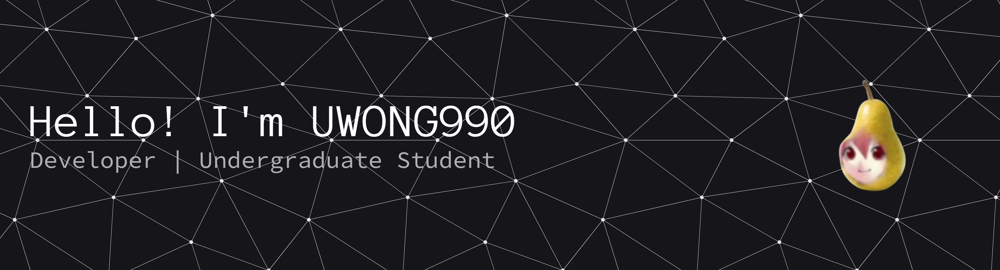

<!--
**UWONG990/UWONG990** is a ✨ _special_ ✨ repository because its `README.md` (this file) appears on your GitHub profile.

Here are some ideas to get you started:

- 🔭 I’m currently working on ...
- 🌱 I’m currently learning ...
- 👯 I’m looking to collaborate on ...
- 🤔 I’m looking for help with ...
- 💬 Ask me about ...
- 📫 How to reach me: ...
- 😄 Pronouns: ...
- ⚡ Fun fact: ...
-->
#### Hi there 👋 I'm UWONG990

Welcome to my GitHub profile! I'm passionate about technology, coding, and continuous learning. Here you'll find my latest projects, and experiments.

## 🚀 About Me

- I love building and exploring new technologies.
- Currently learning: Cloud computing, AI, and modern web frameworks.
- Tech stack: Vue, Kotlin, Node.js, Python, Javascript.
- Open to collaboration on interesting projects and open source.

---

Thanks for visiting my profile! Feel free to connect or check out my repositories.
